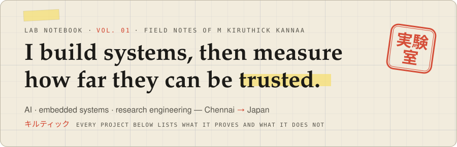
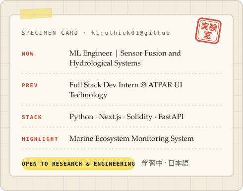
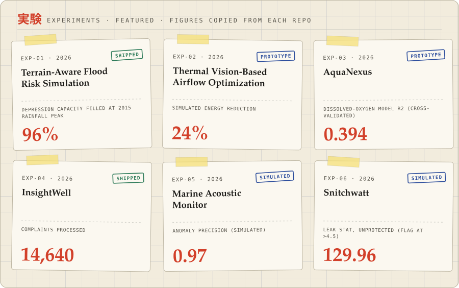
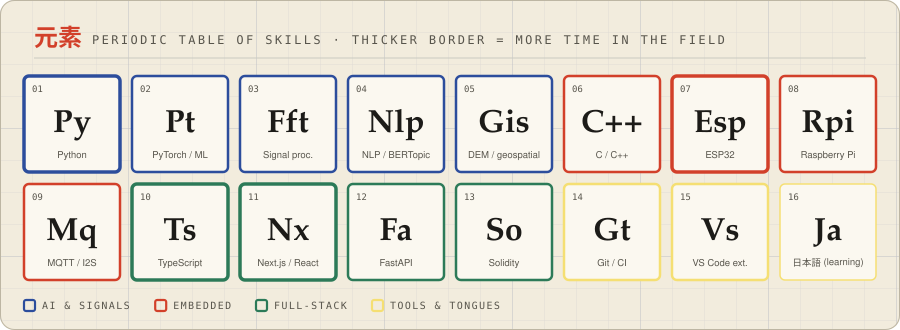

<picture>
  <source media="(prefers-color-scheme: dark)" srcset="assets/banner-dark.svg">
  
</picture>

<table>
  <tr>
    <td></td>
    <td>
      <picture>
        <source media="(prefers-color-scheme: dark)" srcset="assets/info-card-dark.svg">
        
      </picture>
    </td>
  </tr>
</table>

 

  

<picture>
  <source media="(prefers-color-scheme: dark)" srcset="assets/experiments-dark.svg">
  
</picture>

**Read the write-ups:**
[TADRO](https://github.com/kiruthick01/terrain-aware-drainage-route-optimization) ·
[TVBAO](https://github.com/kiruthick01/Thermal-Vision-Based-Airflow-Optimization) ·
[AquaNexus](https://github.com/kiruthick01/AquaNexus) ·
[InsightWell](https://github.com/kiruthick01/InsightWell) ·
[Snitchwatt](https://github.com/kiruthick01/SnitchWatt) ·
[Marine Acoustic Monitor](https://github.com/kiruthick01/Marine-Acoustic-Monitor)

 

<picture>
  <source media="(prefers-color-scheme: dark)" srcset="assets/elements-dark.svg">
  
</picture>

Each figure is copied from the repo it belongs to, with its limits noted there. Full write-ups with what each project proves, and what it does not: <a href="https://kiruthicklocksin.vercel.app">kiruthicklocksin.vercel.app</a>

